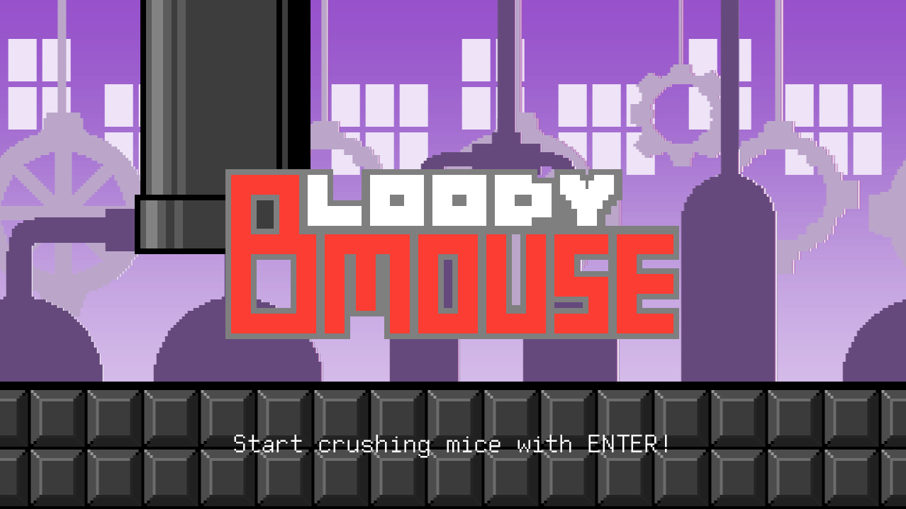
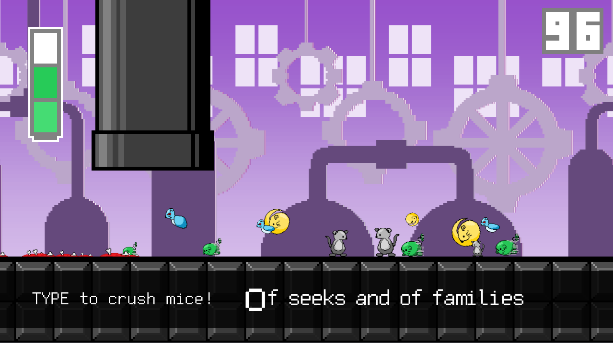

# About Bloody Mouse:

Bloody Mouse is a game made for [Mashup Game Jam 2](https://itch.io/jam/mashup-game-jam-2). The game and all the art are made within 72 hours of the game jam.

Main post: [https://friedcroco070801.itch.io/bloody-mouse](https://friedcroco070801.itch.io/bloody-mouse)

# System requirement:

This game is designed to run on Windows 8.0+.

No further information about the systems is required.

# Some Screenshots:

# Download:

Main post: [https://friedcroco070801.itch.io/bloody-mouse](https://friedcroco070801.itch.io/bloody-mouse)

# Technology:

C++/Cocos2d-x 4.0